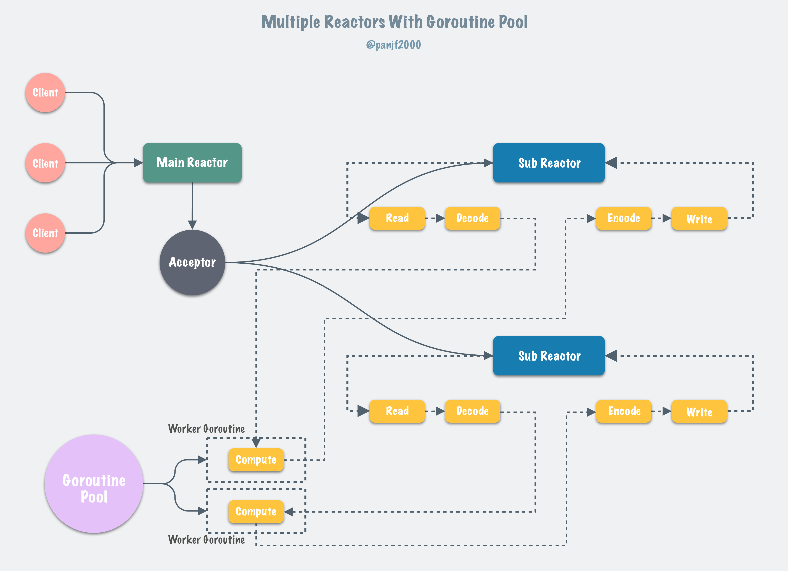
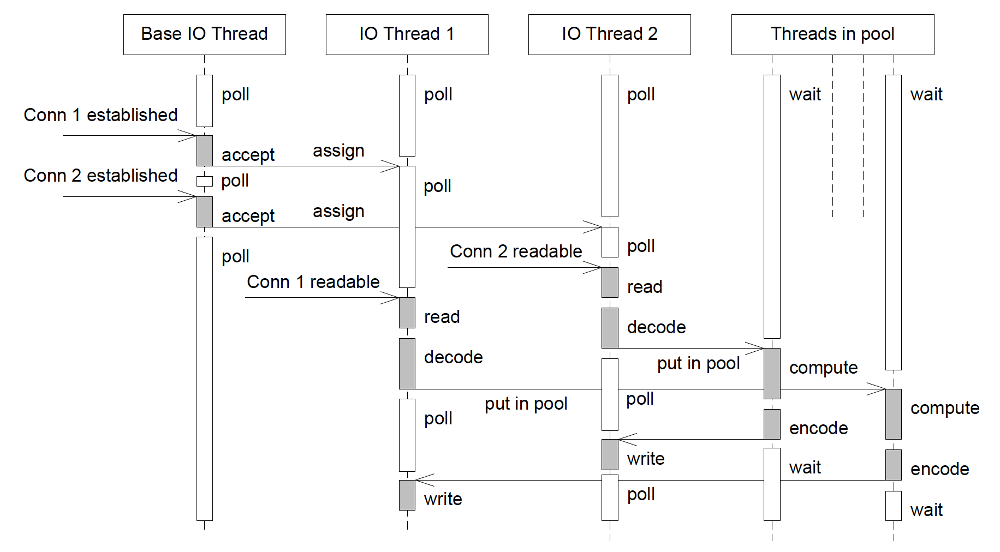

# golang net
    /usr/local/Cellar/go/1.23.4/libexec/src/net

## Listen
net.Listen：创建监听套接字时，Go会根据操作系统选择合适的多路复用机制，
在Linux上默认使用epoll。

epoll_create 方法
创建一个epoll池
```go
//runtime/netpoll_epoll.go
func netpollinit() {
    // 调通epoll_create，创建epoll池
    epfd = epollcreate1(_EPOLL_CLOEXEC)
}
```

## Accept
listener.Accept：接受连接时，epoll会监控监听套接字是否有新的连接请求，
并在有请求时触发。

epoll_ctl 方法
将新连接加入 epoll 池
```go
//runtime/netpoll_epoll.go
func netpollopen(fd uintptr, pd *pollDesc) int32 {
    var ev epollevent
    ev.events = _EPOLLIN | _EPOLLOUT | _EPOLLRDHUP | _EPOLLET
    *(**pollDesc)(unsafe.Pointer(&ev.data)) = pd
    // 调用epoll_ctl，将需要监听的连接加到epoll池里
    return -epollctl(epfd, _EPOLL_CTL_ADD, int32(fd), &ev)
}
```

## Read Write
conn.Read 和 conn.Write：读写操作时，epoll会监控文件描述符是否
可读或可写，从而提高I/O效率。

感知网络 IO 就绪事件，
即 “**数据准备阶段完成，驱动程序和操作系统从网卡读取数据到 socket 的接收缓冲区。**”
这时需要将相关协程唤醒调度到 m 执行读写,即“**应用程序将内核 socket缓冲区数据复制到用户空间**”。

epoll_wait 方法，获取就绪事件队列 events,然后遍历事件队列，返回关联协程
### 1.sysmon
全局监控任务 sysmon,单独线程运行
```go
// runtime/proc.go
func main() {
    // 启动一个线程
    systemstack(func() {
        newm(sysmon, nil, -1)
    })
    
}
```
```go
func sysmon() {
    for {
        // 每隔10s周期处理
        // poll network if not polled for more than 10ms
        lastpoll := sched.lastpoll.Load()
        if netpollinited() && lastpoll != 0 && lastpoll+10*1000*1000 < now {
            sched.lastpoll.CompareAndSwap(lastpoll, now)
            // 获取网络IO就绪的协程列表
            list, delta := netpoll(0) // non-blocking - returns list of goroutines
            if !list.empty() {
                // 唤醒就绪协程
                injectglist(&list)
            }
        }
    }
}
```
```go
//  runtime/netpoll_epoll.go
// netpoll checks for ready network connections.
// Returns list of goroutines that become runnable.
func netpoll(delay int64) (gList, int32) {
    var events [128]syscall.EpollEvent
    // 调用epoll_wait非阻塞获取就绪的网络IO事件
    n, errno := syscall.EpollWait(epfd, events[:], int32(len(events)), waitms)
    //从events中获取事件对应的协程
    
    return toRun, delta
}
```
### 2.findRunnable
协程调度流程，为当前 p寻找下一个可执行 g,如果没有可用的，会执行findRunnable
```go
// runtime/proc.go
// Finds a runnable goroutine to execute.
func findRunnable() (gp *g, inheritTime, tryWakeP bool) {
    // Poll network.
    
    // P 本地队列和全局队列都没有待执行的协程
    if netpollinited() && netpollAnyWaiters() && sched.lastpoll.Load() != 0 {
        // 调用epoll_wait获取IO事件就绪协程列表
        if list, delta := netpoll(0); !list.empty() { // non-blocking
            gp := list.pop()
            // 唤醒相关协程
            injectglist(&list)
        }
    }
}
```
### 3.GC
STW（stop the world）-> start the world
```go
//runtime/proc.go

// stattTheWorldWithSema returns now.
func startTheWorldWithSema(now int64, w worldStop) int64 {
    if netpollinited() {
        list, delta := netpoll(0) // non-blocking
        injectglist(&list) // 唤醒IO就绪的协程列表
    }
}
```

## 扩展
### [tidwall/evio](https://github.com/tidwall/evio)
与 Go 官方的 net 库相比，tidwall/evio 通过直接调用操作系统的 epoll（在 Linux 上）或 kqueue（在 FreeBSD 和 macOS 上）系统调用，避免了标准库中可能存在的抽象层开销，从而提高了 I/O 操作的效率。


此外，evio 采用事件驱动模型，使用单线程或多线程事件循环，减少了 Goroutine 的创建和调度开销。 相比之下，Go 的 net 库通常为每个连接分配一个 Goroutine，在高并发场景下可能导致大量 Goroutine 的创建和上下文切换，增加调度器的负担。


然而，需要注意的是，evio 并非适用于所有场景。 对于需要长时间运行的请求（如数据库访问、身份验证等），官方建议仍然使用 Go 的 net 或 net/http 库。 此外，evio 的设计初衷是用于特定的高性能场景，如构建类似 Redis 或 HAProxy 的服务器。

### [cloudwego/netpoll](https://github.com/cloudwego/netpoll)
* LinkBuffer 提供可以流式读写的 nocopy API
* gopool 提供高性能的 goroutine 池
* mcache 提供高效的内存复用
* IsActive 支持检查连接是否存活
* Dialer 支持构建 client
* EventLoop 支持构建 server
* 支持 TCP，Unix Domain Socket
* 支持 Linux，macOS（操作系统）

### [panjf2000/gnet](https://github.com/panjf2000/gnet)

gnet 是一个基于事件驱动的高性能和轻量级网络框架。这个框架是基于 epoll 和 kqueue 从零开发的，而且相比 Go net，它能以更低的内存占用实现更高的性能。

gnet 和 net 有着不一样的网络编程范式。因此，用 gnet 开发网络应用和用 net 开发区别很大，而且两者之间不可调和。社区里有其他同类的产品像是 libuv, netty, twisted, tornado，gnet 的底层工作原理和这些框架非常类似。

gnet 不是为了取代 net 而生的，而是在 Go 生态中为开发者提供一个开发性能敏感的网络服务的替代品。也正因如此，gnet 在功能全面性上比不了 Go net，它只会提供网络应用所需的最核心的功能和最精简的 APIs，而且 gnet 也并没有打算变成一个无所不包的网络框架，因为我觉得 Go net 在这方面已经做得足够好了。

gnet 的卖点在于它是一个高性能、轻量级、非阻塞的纯 Go 语言实现的传输层（TCP/UDP/Unix Domain Socket）网络框架。开发者可以使用 gnet 来实现自己的应用层网络协议(HTTP、RPC、Redis、WebSocket 等等)，从而构建出自己的应用层网络服务。比如在 gnet 上实现 HTTP 协议就可以创建出一个 HTTP 服务器 或者 Web 开发框架，实现 Redis 协议就可以创建出自己的 Redis 服务器等等。

gnet 衍生自另一个项目：evio，但拥有更丰富的功能特性，且性能远胜之。
* 基于多线程/协程网络模型的高性能事件驱动循环
* 内置 goroutine 池，由开源库 ants 提供支持
* 整个生命周期是无锁的
* 简单易用的 APIs
* 高效、可重用而且自动伸缩的内存 buffer：(Elastic-)Ring-Buffer, Linked-List-Buffer and Elastic-Mixed-Buffer
* 多种网络协议/IPC 机制：TCP、UDP 和 Unix Domain Socket
* 多种负载均衡算法：Round-Robin(轮询)、Source-Addr-Hash(源地址哈希) 和 Least-Connections(最少连接数)
* 灵活的事件定时器
* gnet 客户端支持
* 支持 Linux, macOS, Windows 和 *BSD 操作系统: Darwin/DragonFlyBSD/FreeBSD/NetBSD/OpenBSD
* Edge-triggered I/O 支持
* 多网络地址绑定




test case

1. v2:
    server
    ```
     go run main.go 
    [gnet] 2025-02-06T19:36:28.953536+08:00 INFO    logging/logger.go:256   Launching gnet with 1 event-loops, listening on: tcp://:9000
    2025/02/06 19:36:28 echo server with multi-core=false is listening on tcp://:9000
    ```
    client
    ```
    echo -e "dddd" |nc 0.0.0.0 9000
    dddd
    ```
2. v1:
    server 
    ```
     go run server.go
    2025/02/06 20:15:25 Test codec server is listening on :9000 (multi-cores: true, loops: 8)
    ```
    client
    ```
    go run client.go     
    received:  hello
    received:  world
    ```
#### 参考
* [https://strikefreedom.top/archives/go-event-loop-networking-library-gnet](https://strikefreedom.top/archives/go-event-loop-networking-library-gnet)
* [https://www.51cto.com/article/711144.html](https://www.51cto.com/article/711144.html)
* [https://github.com/gnet-io/gnet-benchmarks/blob/v2/echo-gnet-server/main.go](https://github.com/gnet-io/gnet-benchmarks/blob/v2/echo-gnet-server/main.go)